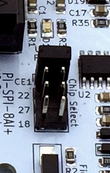

# Getting Started

- [Stack Architecture](#stack-architecture)
- [RPi hardware configuration (for MCP3008)](#rpi-hardware-configuration--for-mcp3008-)
- [Software installation](#software-installation)

## Stack Architecture


This stack is composed with :

- ADC Monitor provide an API to get all input values for [Widgetlords Pi-SPi-8AI](https://widgetlords.com/products/pi-spi-8ai-raspberry-pi-analog-input-interface) boards with MCP3008 chip. Monitor is written in C,
  with two tasks:
    - A reading loop to update internally all inputs values,
    - A TCP socket API server available on port 3000 to expose all inputs values in JSON for external service,
- A basic WebSocket Gateway available on port 8888, written in JavaScript and runnable with node.JS,
- A lightweight Web Server, with only one page to expose the HTML/Javascript and WebSocket Client interface.

The TCP socket API server accepts only one client: the `WebSocket Gateway` which more easily provides multi-client mode.  
The API provide only two methods:
  
- `get/all` to get all values:  

<table>
<tr>
<th>
Query
</th>
<th>
Response
</th>
</tr>
<tr>
<td valign="top">
<pre lang="json">
{
    "topic": "get/all",
    "payload": {}
}
</pre>
</td>
<td valign="top">
<pre lang="json">
{
    "status": 200,
    "timestamp": &lt;timestamp>
    "payload": {
        "adc": {
            "i": [&lt;index>],
            "v": [&lt;value>]
        },
        "io": {
            "i": [&lt;index>],
            "v": [&lt;value>]
        },
        "sw_version": "&lt;version>"
    }
}
</pre>
</td>
</tr>
</table>

- `set/out` to enable an output:  

<table>
<tr>
<th>
Query
</th>
<th>
Response
</th>
</tr>
<tr>
<td valign="top">
<pre lang="json">
{
    "topic": "set/out",
    "payload": {
        "i": [&lt;index>],
        "v": [&lt;value>]
    }
}
</pre>
</td>
<td valign="top">
<pre lang="json">
{
    "status": 201,
    "timestamp": &lt;timestamp>
    "payload": {
        "io": {
            "i": [&lt;index>],
            "v": [&lt;value>]
        },
    }
}
</pre>
</td>
</tr>
</table>

The field `payload` takes an object with the `i` and `v` fields, which are two arrays:

- Array `i` contains all the variables indexes
- Array `v` contains all the variables values

For io, for the moment, only 2 outputs are driven (see the mapping in `adc-monitor/src/drivers/gpio.c`):  
- `GPIO23` as `O_KA1` with the index `0`
- `GPIO24` as `O_KA2` with the index `1`  

Once connected, the TCP socket API server automatically sends all (but only) updated inputs. Then, you have to associate the indexes with the values contained in the two arrays.

## RPi hardware configuration (for MCP3008)

1. Enable the SPI interface, with the command:

```bash
$ sudo raspi-config
```

Then, select `Interface Options` > `SPI` > `Yes`

2. Install the `libwidgetlords` package

```bash
$ wget https://github.com/widgetlords/libwidgetlords/releases/download/v2.1.1/libwidgetlords_2.1.1_arm64.deb
$ sudo dpkg -i libwidgetlords_2.1.1_arm64.deb
```

**NOTE:** If you have previously installed the library you must remove it first using

```bash
$ sudo apt remove libwidgetlords
```

For more information, see https://widgetlords.com/pages/getting-started-with-pi-spi-libraries

3. Edit the `/boot/config.txt` file add to dtoverlay:

```
dtoverlay=pi-spi:extra_cs=true
```

Then `reboot` your Raspberry

4. Check if the SPI devices are properly mounted with the command:

```bash
$ ls /dev | grep spidev
```

5. Address the chips

The four chip selects are shown here:



Only 1 jumper should be installed at a time.  
Typically, the jumpers are installed as follows:

| Jumper | Module |   Interface    |               Address                | JSON index |
|:------:|:------:|:--------------:|:------------------------------------:|:----------:|
|  CE1   |   1    | /dev/spidev0.1 | ADC_DEV_0_CHAN_0 .. ADC_DEV_0_CHAN_7 |   0 .. 7   |
|   22   |   2    | /dev/spidev0.4 | ADC_DEV_1_CHAN_0 .. ADC_DEV_1_CHAN_7 |  8 .. 15   |
|   27   |   3    | /dev/spidev0.5 | ADC_DEV_2_CHAN_0 .. ADC_DEV_2_CHAN_7 |  16 .. 23  |
|   18   |   4    | /dev/spidev0.6 | ADC_DEV_3_CHAN_0 .. ADC_DEV_3_CHAN_7 |  24 .. 31  |

## Software installation

Run the following commands:

```bash
$ git clone https://github.com/a-tortevois/widgetlords-pi-spi-8ai.git
$ cd widgetlords-pi-spi-8ai
$ chmod +x run.sh
$ ./run.sh --install
$ systemctl start adc_monitor.service
$ systemctl start adc_monitor_websocket_gateway.service
$ systemctl start adc_monitor_web_server.service
$ systemctl list-units --type=service | grep adc_monitor
```

## Software update

Run the following commands:

```
$ cd widgetlords-pi-spi-8ai
$ git fetch --all
$ git reset --hard
$ git pull --all
$ systemctl stop adc_monitor*
$ chmod +x run.sh
$ ./run.sh --install
```